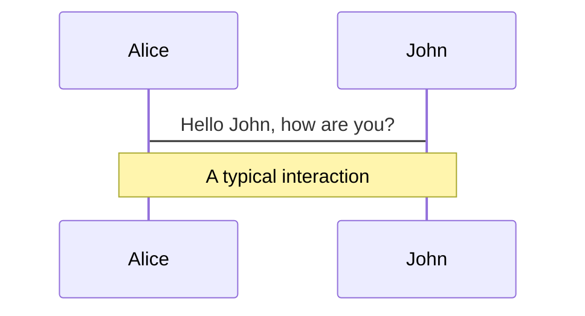
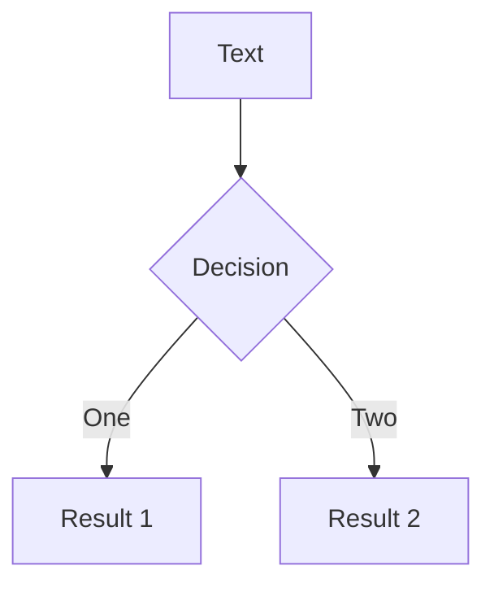
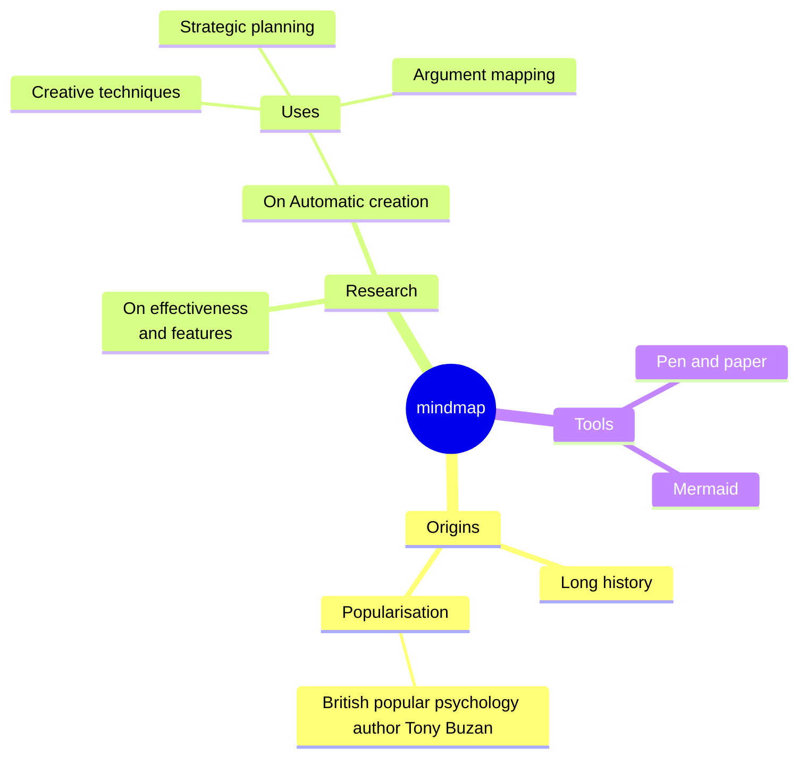
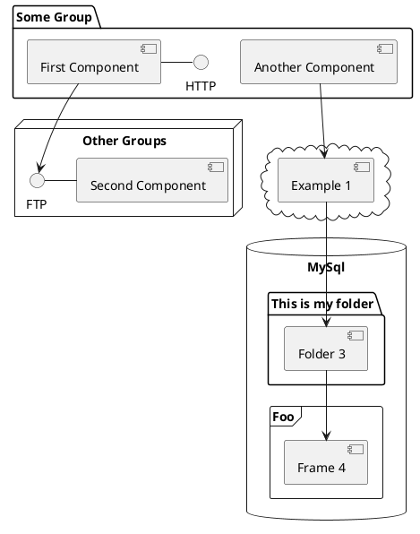

---
layout: about-slide
transition: view-transition
---

I'm a **Staff Software Engineer** at **Western Governors University** working on the **Open edX platform**. With a background in both software engineering and design, I focus on building scalable systems and improving the tools and experiences used by educators, developers, and learners.

---
transition: slide-left
level: 2
---

# The Problem

E2E tests are expensive. Three kinds of expensive.

<div v-click>

**Creation Cost** — Time and expertise that most organizations don't have in abundance.

</div>

<div v-click>

**Runtime Cost** — Every test run takes time on developer machines or CI compute time.

</div>

<div v-click>

**Maintenance Cost** — Keeping selectors up to date and test environments stable.

</div>

<div v-click>

Given all that cost, most teams extract **one output**: a pass/fail signal. That's leaving significant value on the table.

</div>

---
transition: slide-left
level: 2
---

# More Problems

But wait, there's more!

<div v-click>

**Accessibility** — Audits are usually manual and don't happen often enough. Violations accumulate over time without being fixed.

</div>

<div v-click>

**Documentation** — Writing documentation is a manual process that is time consuming for something that has a very short shelf life.

</div>

<div v-click>

**Screenshots** — UI changes ship constantly and screenshots go out of date quickly.

</div>

<div v-click>

**Visual Regression** — Subtle layout changes and UI drift are hard to detect between releases.

</div>

---
transition: slide-left
level: 2
---

# The Solution

The parts of Open edX worth **documenting** are almost always the parts worth writing **E2E, A11y, and Visual Regression tests** for. So why maintain multiple separate efforts?

<div class="mt-6" v-click>
Introducing:
<div class="flex gap-12">
<div class="whitespace-nowrap">

## `openedx-e2e-tests`


</div>
<div>

A comprehensive **Playwright** testing library for Open edX with automated documentation generation, accessibility testing, and visual regression capabilities.

https://github.com/WGU-Open-edX/openedx-e2e-tests

```bash
npm install openedx-e2e-tests
```

</div>
</div>
</div>


---

# One Codebase. Four Outputs.

Write the test once. Get everything else for (almost) free.

<div v-click>

**Test Coverage** — `playwright/test` Validate critical user flows across MFEs, authentication, and LMS workflows.

</div>
<div v-click>

**Accessibility Reports** — `assertA11y` WCAG violations caught during every test run, with visual evidence and story-ready descriptions.

</div>
<div v-click>

**Documentation** — `TestdocTest` Auto-generated user guides with annotated screenshots, step by step.

</div>
<div v-click>

**Visual Regression** — `VisualRegression` Pixel-level diff detection with red-highlighted changes. Catches what functional tests miss.

</div>

---

````md magic-move {lines: true}
```ts
// Vanilla Playwright — one output: pass/fail
import { test } from '@playwright/test';

test('user can log in', async ({ page }) => {
  await page.goto('/login');
  await page.fill('#username', process.env.TEST_USERNAME!);
  await page.fill('#password', process.env.TEST_PASSWORD!);
  await page.click('button[name="sign-in"]');
});
```

```ts
// assertA11y — now also runs an accessibility audit
import { test } from '@playwright/test';
import { assertA11y } from 'openedx-e2e-tests';

test('user can log in', async ({ page }) => {
  await page.goto('/login');
  
  await assertA11y(page, { report: true }, testInfo);

  await page.fill('#username', process.env.TEST_USERNAME!);
  await page.fill('#password', process.env.TEST_PASSWORD!);
  await page.click('button[name="sign-in"]');
});
```

```ts
// + Testdoc — now generates annotated documentation too
import { test } from '@playwright/test';
import { assertA11y, TestdocTest } from 'openedx-e2e-tests';

test('user can log in', async ({ page }, testInfo) => {
  const testdoc = new TestdocTest(page, 'user-login', {
    title: 'How to Log In',
    overview: 'This guide shows you how to log into Open edX.',
  });

  await testdoc.initialize();
  await page.goto('/login');

  await assertA11y(page, { report: true }, testInfo);

  await testdoc.fill('#username', process.env.TEST_USERNAME!, 'Enter Username');
  await testdoc.fill('#password', process.env.TEST_PASSWORD!, 'Enter Password');
  await testdoc.click('button[name="sign-in"]', 'Submit Login');

  await testdoc.generateMarkdown();
});
```

```ts
// + VisualRegression — pixel-level diff on every run
import { test } from '@playwright/test';
import { assertA11y, TestdocTest, VisualRegression } from 'openedx-e2e-tests';

test('user can log in', async ({ page }, testInfo) => {
  const testdoc = new TestdocTest(page, 'user-login', {
    title: 'How to Log In',
    overview: 'This guide shows you how to log into Open edX.',
  });
  const vr = new VisualRegression(page, testInfo);

  await testdoc.initialize();
  await page.goto('/login');

  await assertA11y(page, { report: true }, testInfo);
  await vr.captureAndCompare({ name: 'login-page' });

  await testdoc.fill('#username', process.env.TEST_USERNAME!, 'Enter Username');
  await testdoc.fill('#password', process.env.TEST_PASSWORD!, 'Enter Password');
  await testdoc.click('button[name="sign-in"]', 'Submit Login');

  await testdoc.generateRST();
});
```
````

<!--
Start with the vanilla test.

Click to step 2: one import, one call to assertA11y.
Now every test run is also an accessibility audit — violations get flagged with visual evidence, ready to drop into a ticket.

Click to step 3: we wrap interactions in TestdocTest.
Same test logic, but now every click and fill captures an annotated screenshot and builds a user guide automatically.

Click to step 4: add VisualRegression.
Now we're comparing pixels on every run. If a shared CSS variable changes and breaks the layout, this catches it — even if all the functional assertions still pass.

Same test, a bit more code, with a ton of added value.
-->

---
layout: two-cols-aside
---

::aside::
<h1 text-2xl!>Running Tests</h1>

Run tests headlessly, with a visible browser, in an interactive UI, or with the debugger attached.

```bash
# Run all tests
npm test

 # With visible browser
npm run test:headed

# Interactive UI mode
npm run test:ui

# With debugger
npm run test:debug

```

::default::
<div class="aspect-square bg-gray">[VIDEO]</div>

---
layout: two-cols-aside
---

::aside::
<h1 text-2xl!>Test Results</h1>

Rich HTML reports with screenshots, traces, and test results. Open in your browser to drill into failures.

```bash
# View Playwright HTML report
npm run report
```

::default::
<div class="aspect-square bg-gray">[VIDEO]</div>

---
layout: two-cols-aside
---

::aside::
<h1 text-2xl!>A11y Test Results</h1>

Violations are compiled into a dedicated report with screenshots, descriptions, and remediation guidance.

```bash
# View accessibility reports
npm run report:a11y
```

::default::
<div class="aspect-square bg-gray">[VIDEO]</div>

---
layout: two-cols-aside
---

::aside::
<h1 text-2xl!>Visual Regression Testing</h1>

Pixel-by-pixel comparison against a stored baseline. Differences are flagged with red-highlighted diffs.

::default::
<div class="aspect-square bg-gray">[VIDEO]</div>

---

# New Problems

What still needs to be solved

- How do we bootstrap test environments with data that our tests rely on?
- How do we cleanup after tests run?
- Can we run tests again mock data and database data?

---

# The End

---
transition: slide-left
level: 2
---

# What is Slidev?

Slidev is a slides maker and presenter designed for developers, consist of the following features

- 📝 **Text-based** - focus on the content with Markdown, and then style them later
- 🎨 **Themable** - themes can be shared and re-used as npm packages
- 🧑‍💻 **Developer Friendly** - code highlighting, live coding with autocompletion
- 🤹 **Interactive** - embed Vue components to enhance your expressions
- 🎥 **Recording** - built-in recording and camera view
- 📤 **Portable** - export to PDF, PPTX, PNGs, or even a hostable SPA
- 🛠 **Hackable** - virtually anything that's possible on a webpage is possible in Slidev
<br>
<br>

Read more about [Why Slidev?](https://sli.dev/guide/why)

<!--
You can have `style` tag in markdown to override the style for the current page.
Learn more: https://sli.dev/features/slide-scope-style
-->

<style>
h1 {
  background-color: #2B90B6;
  background-image: linear-gradient(45deg, #4EC5D4 10%, #146b8c 20%);
  background-size: 100%;
  -webkit-background-clip: text;
  -moz-background-clip: text;
  -webkit-text-fill-color: transparent;
  -moz-text-fill-color: transparent;
}
</style>

<!--
Here is another comment.
-->

---
transition: slide-up
level: 2
---

# Navigation

Hover on the bottom-left corner to see the navigation's controls panel, [learn more](https://sli.dev/guide/ui#navigation-bar)

## Keyboard Shortcuts

|                                                     |                             |
| --------------------------------------------------- | --------------------------- |
| <kbd>right</kbd> / <kbd>space</kbd>                 | next animation or slide     |
| <kbd>left</kbd>  / <kbd>shift</kbd><kbd>space</kbd> | previous animation or slide |
| <kbd>up</kbd>                                       | previous slide              |
| <kbd>down</kbd>                                     | next slide                  |

<!-- https://sli.dev/guide/animations.html#click-animation -->

<p v-after class="absolute bottom-23 left-45 opacity-30 transform -rotate-10">Here!</p>

---
layout: two-cols
layoutClass: gap-16
---

# Table of contents

You can use the `Toc` component to generate a table of contents for your slides:

```html
<Toc minDepth="1" maxDepth="1" />
```

The title will be inferred from your slide content, or you can override it with `title` and `level` in your frontmatter.

::right::

<Toc text-sm minDepth="1" maxDepth="2" />

---
layout: image-right
image: https://cover.sli.dev
---

# Code

Use code snippets and get the highlighting directly, and even types hover!

```ts [filename-example.ts] {all|4|6|6-7|9|all} twoslash
// TwoSlash enables TypeScript hover information
// and errors in markdown code blocks
// More at https://shiki.style/packages/twoslash
import { computed, ref } from 'vue'

const count = ref(0)
const doubled = computed(() => count.value * 2)

doubled.value = 2
```

<arrow v-click="[4, 5]" x1="350" y1="310" x2="195" y2="342" color="#953" width="2" arrowSize="1" />

<!-- This allow you to embed external code blocks -->
<<< @/snippets/external.ts#snippet

<!-- Footer -->

[Learn more](https://sli.dev/features/line-highlighting)

<!-- Inline style -->
<style>
.footnotes-sep {
  @apply mt-5 opacity-10;
}
.footnotes {
  @apply text-sm opacity-75;
}
.footnote-backref {
  display: none;
}
</style>

<!--
Notes can also sync with clicks

[click] This will be highlighted after the first click

[click] Highlighted with `count = ref(0)`

[click:3] Last click (skip two clicks)
-->

---
level: 2
---

# Shiki Magic Move

Powered by [shiki-magic-move](https://shiki-magic-move.netlify.app/), Slidev supports animations across multiple code snippets.

Add multiple code blocks and wrap them with <code>````md magic-move</code> (four backticks) to enable the magic move. For example:

````md magic-move {lines: true}
```ts {*|2|*}
// step 1
const author = reactive({
  name: 'John Doe',
  books: [
    'Vue 2 - Advanced Guide',
    'Vue 3 - Basic Guide',
    'Vue 4 - The Mystery'
  ]
})
```

```ts {*|1-2|3-4|3-4,8}
// step 2
export default {
  data() {
    return {
      author: {
        name: 'John Doe',
        books: [
          'Vue 2 - Advanced Guide',
          'Vue 3 - Basic Guide',
          'Vue 4 - The Mystery'
        ]
      }
    }
  }
}
```

```ts
// step 3
export default {
  data: () => ({
    author: {
      name: 'John Doe',
      books: [
        'Vue 2 - Advanced Guide',
        'Vue 3 - Basic Guide',
        'Vue 4 - The Mystery'
      ]
    }
  })
}
```

Non-code blocks are ignored.

```vue
<!-- step 4 -->
<script setup>
const author = {
  name: 'John Doe',
  books: [
    'Vue 2 - Advanced Guide',
    'Vue 3 - Basic Guide',
    'Vue 4 - The Mystery'
  ]
}
</script>
```
````

---

# Components

<div grid="~ cols-2 gap-4">
<div>

You can use Vue components directly inside your slides.

We have provided a few built-in components like `<Tweet/>` and `<Youtube/>` that you can use directly. And adding your custom components is also super easy.

```html
<Counter :count="10" />
```

<!-- ./components/Counter.vue -->
<Counter :count="10" m="t-4" />

Check out [the guides](https://sli.dev/builtin/components.html) for more.

</div>
<div>

```html
<Tweet id="1390115482657726468" />
```

<Tweet id="1390115482657726468" scale="0.65" />

</div>
</div>

<!--
Presenter note with **bold**, *italic*, and ~~striked~~ text.

Also, HTML elements are valid:
<div class="flex w-full">
  <span style="flex-grow: 1;">Left content</span>
  <span>Right content</span>
</div>
-->

---
class: px-20
---

# Themes

Slidev comes with powerful theming support. Themes can provide styles, layouts, components, or even configurations for tools. Switching between themes by just **one edit** in your frontmatter:

<div grid="~ cols-2 gap-2" m="t-2">

```yaml
---
theme: default
---
```

```yaml
---
theme: seriph
---
```


</div>

Read more about [How to use a theme](https://sli.dev/guide/theme-addon#use-theme) and
check out the [Awesome Themes Gallery](https://sli.dev/resources/theme-gallery).

---

# Clicks Animations

You can add `v-click` to elements to add a click animation.

<div v-click>

This shows up when you click the slide:

```html
<div v-click>This shows up when you click the slide.</div>
```

</div>

<br>

<v-click>

The <span v-mark.red="3"><code>v-mark</code> directive</span>
also allows you to add
<span v-mark.circle.orange="4">inline marks</span>
, powered by [Rough Notation](https://roughnotation.com/):

```html
<span v-mark.underline.orange>inline markers</span>
```

</v-click>

<div mt-20 v-click>

[Learn more](https://sli.dev/guide/animations#click-animation)

</div>

---

# Motions

Motion animations are powered by [@vueuse/motion](https://motion.vueuse.org/), triggered by `v-motion` directive.

```html
<div
  v-motion
  :initial="{ x: -80 }"
  :enter="{ x: 0 }"
  :click-3="{ x: 80 }"
  :leave="{ x: 1000 }"
>
  Slidev
</div>
```

<div class="w-60 relative">
  <div class="relative w-40 h-40">
    
    
    
  </div>

  <div
    class="text-5xl absolute top-14 left-40 text-[#2B90B6] -z-1"
    v-motion
    :initial="{ x: -80, opacity: 0}"
    :enter="{ x: 0, opacity: 1, transition: { delay: 2000, duration: 1000 } }">
    Slidev
  </div>
</div>

<!-- vue script setup scripts can be directly used in markdown, and will only affects current page -->
<script setup lang="ts">
const final = {
  x: 0,
  y: 0,
  rotate: 0,
  scale: 1,
  transition: {
    type: 'spring',
    damping: 10,
    stiffness: 20,
    mass: 2
  }
}
</script>

<div
  v-motion
  :initial="{ x:35, y: 30, opacity: 0}"
  :enter="{ y: 0, opacity: 1, transition: { delay: 3500 } }">

[Learn more](https://sli.dev/guide/animations.html#motion)

</div>

---

# $\LaTeX$

$\LaTeX$ is supported out-of-box. Powered by [$\KaTeX$](https://katex.org/).

<div h-3 />

Inline $\sqrt{3x-1}+(1+x)^2$

Block
$$ {1|3|all}
\begin{aligned}
\nabla \cdot \vec{E} &= \frac{\rho}{\varepsilon_0} \\
\nabla \cdot \vec{B} &= 0 \\
\nabla \times \vec{E} &= -\frac{\partial\vec{B}}{\partial t} \\
\nabla \times \vec{B} &= \mu_0\vec{J} + \mu_0\varepsilon_0\frac{\partial\vec{E}}{\partial t}
\end{aligned}
$$

[Learn more](https://sli.dev/features/latex)

---

# Diagrams

You can create diagrams / graphs from textual descriptions, directly in your Markdown.

<div class="grid grid-cols-4 gap-5 pt-4 -mb-6">









</div>

Learn more: [Mermaid Diagrams](https://sli.dev/features/mermaid) and [PlantUML Diagrams](https://sli.dev/features/plantuml)

---
foo: bar
dragPos:
  square: 691,32,167,_,-16
---

# Draggable Elements

Double-click on the draggable elements to edit their positions.

<br>

###### Directive Usage

```md

```

<br>

###### Component Usage

```md
<v-drag text-3xl>
  <div class="i-carbon:arrow-up" />
  Use the `v-drag` component to have a draggable container!
</v-drag>
```

<v-drag pos="663,206,261,_,-15">
  <div text-center text-3xl border border-main rounded>
    Double-click me!
  </div>
</v-drag>


###### Draggable Arrow

```md
<v-drag-arrow two-way />
```

<v-drag-arrow pos="67,452,253,46" two-way op70 />

---
src: ./pages/imported-slides.md
hide: false
---

---

# Monaco Editor

Slidev provides built-in Monaco Editor support.

Add `{monaco}` to the code block to turn it into an editor:

```ts {monaco}
import { ref } from 'vue'
import { emptyArray } from './external'

const arr = ref(emptyArray(10))
```

Use `{monaco-run}` to create an editor that can execute the code directly in the slide:

```ts {monaco-run}
import { version } from 'vue'
import { emptyArray, sayHello } from './external'

sayHello()
console.log(`vue ${version}`)
console.log(emptyArray<number>(10).reduce(fib => [...fib, fib.at(-1)! + fib.at(-2)!], [1, 1]))
```

---
layout: center
class: text-center
---

# Learn More

[Documentation](https://sli.dev) · [GitHub](https://github.com/slidevjs/slidev) · [Showcases](https://sli.dev/resources/showcases)

<PoweredBySlidev mt-10 />
